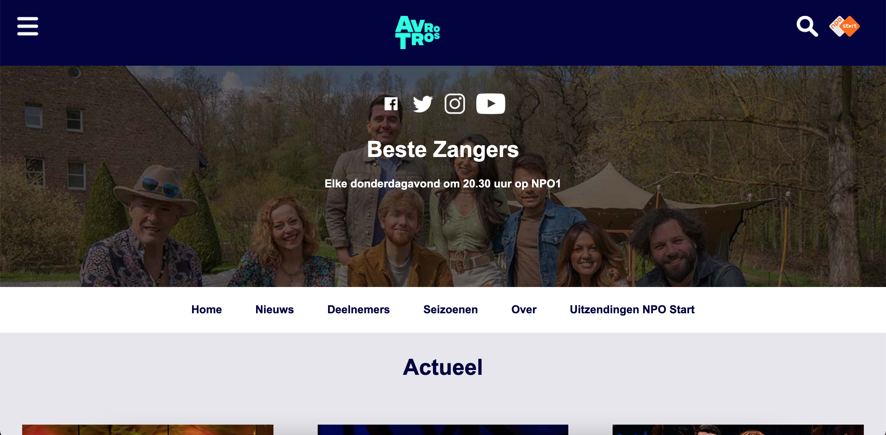
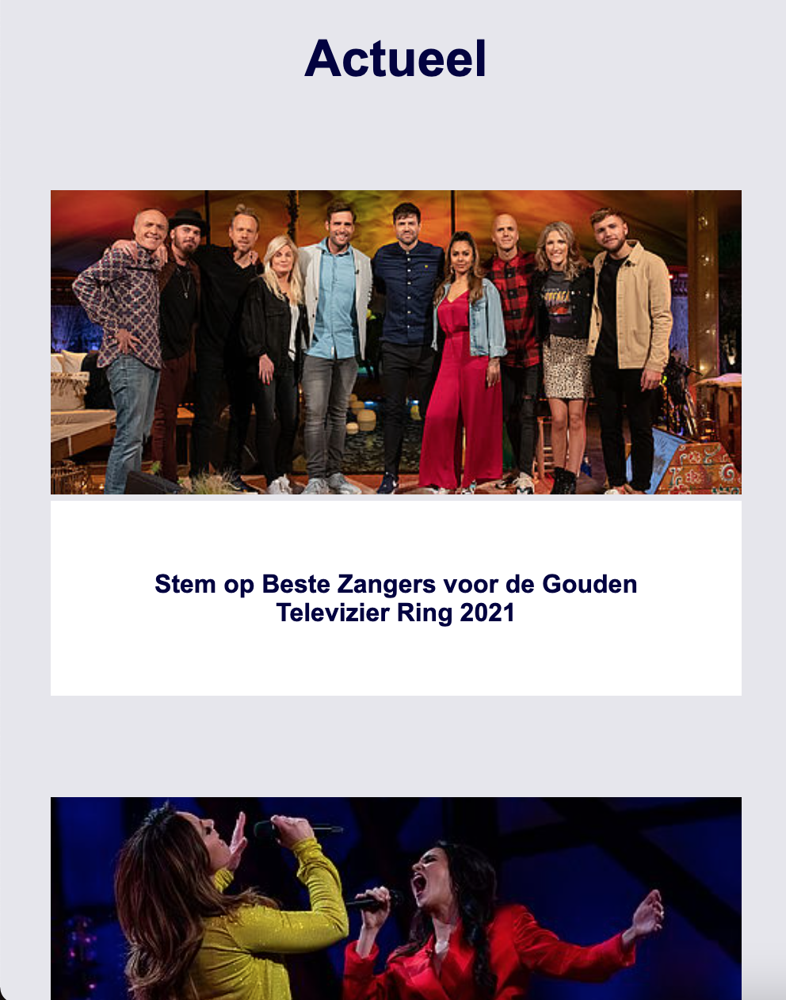
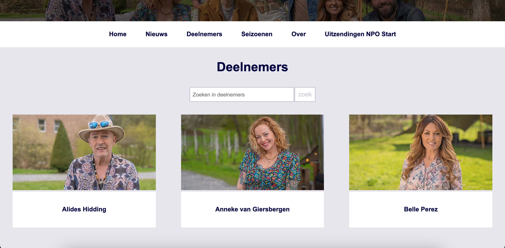
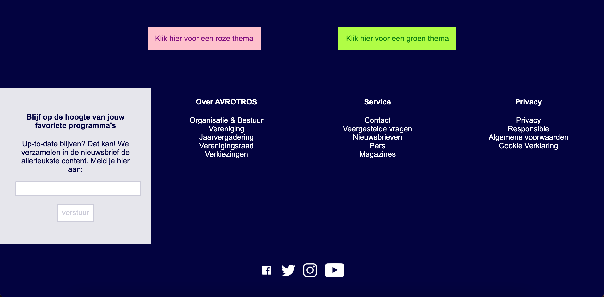

# Procesverslag
Markdown is een simpele manier om HTML te schrijven.  
Markdown cheat cheet: [Hulp bij het schrijven van Markdown](https://github.com/adam-p/markdown-here/wiki/Markdown-Cheatsheet).

Nb. De standaardstructuur en de spartaanse opmaak van de README.md zijn helemaal prima. Het gaat om de inhoud van je procesverslag. Besteedt de tijd voor pracht en praal aan je website.

Nb. Door *open* toe te voegen aan een *details* element kun je deze standaard open zetten. Fijn om dat steeds voor de relevante stuk(ken) te doen.

## Jij

uitwerken voor kick-off werkgroep

### Auteur:
Edie Postma

#### Je startniveau:
Blauw

#### Je focus:
Responsive
 

## Je website

uitwerken voor kick-off werkgroep

### Je opdracht:
https://www.avrotros.nl/beste-zangers/home/

#### Screenshot(s) van de eerste pagina (small screen): 
Beste zangers homescreen  

#### Screenshot(s) van de tweede pagina (small screen):
Beste zangers deelnemers  

 

## Voortgang 1 

uitwerken voor 1e voortgang

### Stand van zaken
Deze week ben ik begonnen met de html van de homepage. Het was niet heel veel en de meeste dingen zitten denk ik wel goed maar voor een aantal stukjes weet ik niet of ik de goede elementen gebruik. 

Vragen:  
* V: Hoe verwijder ik de bestanden die ik verkeerd heb toegevoegd?
* A: Zelf uitgezocht
* V: Waarom staat er (deleted) achter mijn readme file?
* A: Had hem in de verkeerde map staan
* V: Waarom slaat mijn html niet op?
* A: Cache moest geleegd worden

## Voortgang 2 

uitwerken voor 2e voortgang

### Stand van zaken
Deze week heb ik de andere html er bij gemaakt en ben ik begonnen aan een stukje CSS. Hierbij heb ik vooral de basisopmaak en de makkelijke dingen gedaan dus hier kwam ik nog redelijk goed uit.

Vragen:  
* V: Moeten de socials ook in een ul?
* A: Ja
* V: Hoe load je een webfont in?
* A: Zelf uitgezocht

## Voortgang 3 

uitwerken voor 3e voortgang

### Stand van zaken
Deze week ben ik verder gegaan met zowel de html als de css. Ik heb me vooral gefocust op de header.

Vragen:  
* V: Waarom laden mijn screenshots in de README niet?
* A: Opgelost
* V: Hoe deel ik het bovenste balkje in?
* A: ul
* V: Klopt section in header?
* A: Nee, mag een div zijn
* V: Wat is het verschil tussen 
* li a
* &
* li > a
* A: > gebruik je alleen voor direct child als het niet anders kan
* V: Waarom zit er een blauwe rand om de section in de header?
* A: Dat is een standaard opmaak, die kan je resetten door bij de elementen padding en margin op 0 te zetten.
* V: Het font van de website is geen webfont, moet ik een kiezen die er op lijkt?
* A: Ja  
Comment: Begin vast met de flexbox en micro interactie: zoekbalkje die invliegt. Om de socials moet nog een a zodat ze klikbaar zijn

## Voortgang 4 

uitwerken voor 4e voortgang

### Stand van zaken
Deze week ben ik verder gegaan met een groot deel van de CSS en ben ik begonnen met het grid. Ook heb ik hulp gehad met het maken van een micro interactie.

Vragen:  
* V: waarom pakt het bovenste balkje de id niet?
* A: opgelost
* V: waar komt dat kleine balkje in de articles vandaan? & margin om de header heen?
* A: body heeft een padding
* V: wat gebeurd er met de marge, width en overlapping bij het grid?
* A: opgelost in css

## Eindgesprek 

uitwerken voor eindgesprek

### Stand van zaken
De basis van html, css en js ken ik nu wel redelijk. Ik heb wat moeite gehad met flexbox en grid maar ben er voor het grootste deel wel uitgekomen. Het eindresultaat is in ieder geval een responsive website met microinteractie waar ik heel trots op ben.

### Screenshot(s)

## Bronnenlijst

1. https://www.w3schools.com/
2. Hulp van student Denise Radstaat met micro interactie
3. https://css-tricks.com/auto-sizing-columns-css-grid-auto-fill-vs-auto-fit/
4. https://css-tricks.com/snippets/css/a-guide-to-flexbox/
5. https://flexboxfroggy.com/#nl

